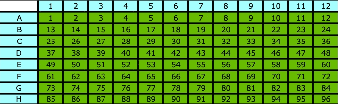

# Analysis for [AccuraSCOPE® Single Cell Transcriptome and Genome Library Kit](https://singleron.bio/products/accurascope/)

A versatile single cell whole genome sequencing method that amplifies both the DNA and RNA from 96 individual cells in parallel.

## Installation

First, FASTQ files need to be demultiplexed into individual wells (cells). This requires installing the `sccore` package.

```bash
pip install sccore
```

After demultiplexing, it is recommended to use [nf-core/rnaseq](https://github.com/nf-core/rnaseq) for RNA data analysis and [nf-core/sarek](https://github.com/nf-core/sarek) for DNA data analysis.

## RNA Analysis

### Demultiplexing

```bash
split_accura \
  --fq1 ./fastqs/X_001_R1.fastq.gz,./fastqs/X_002_R1.fastq.gz \
  --fq2 ./fastqs/X_001_R2.fastq.gz,./fastqs/X_002_R2.fastq.gz \
  --well_name well_name.tsv \
  --library_type rna \
  --chemistry AccuraSCOPE_RNA
```

[`split_accura`](https://github.com/singleron-RD/sccore/blob/main/sccore/cli/split_accura.py) is a script included in the `sccore` CLI

**Parameters:**
- `--fq1`: Input read1 FASTQ file (R1). Multiple files should be comma-separated
- `--fq2`: Input read2 FASTQ file (R2). Multiple files should be comma-separated  
- `--well_name`: Well name file (tab-delimited, two columns: well number and user-defined name, e.g., `1\tcell_1`), no header
- `--chemistry`: `AccuraSCOPE_RNA` or `ARC_RNA`. Default is `AccuraSCOPE_RNA`. Note: The whitelists used by these two chemistries differ slightly in their barcode sequences. Please consult your sales representative for the specific chemistry details to ensure correct selection.

**96 well number(8 * 12)**
  


- `--library_type`: `rna` or `dna`

**Output:**
Output metrics and demultiplexed FASTQ files are located in the `./rna` directory.

- **rna_metrics.txt**
  ```
  total_reads: 100000
  p3_reads: 40279 (40.28%)     # Number of 3' prime reads
  p5_reads: 56758 (56.76%)     # Number of 5' prime reads
  signal_reads: 97003 (97.0%)  # Number of reads assigned to signal wells (specified by --well_name)
  ```

- **rna_read_count.txt**: Read counts per well
- **rna_samplesheet.csv**: Input samplesheet for [nf-core/rnaseq](https://github.com/nf-core/rnaseq)

### Run nf-core/rnaseq

**Nextflow Command:**
```bash
nextflow run nf-core/rnaseq \
  -params-file params.yaml -profile docker -bg -resume
```

**params.yaml:**
```yaml
custom_config_base: null
input: 'rna/rna_samplesheet.csv'
fasta: genome.fasta
gtf: genome.gtf
trimmer: fastp
extra_fastp_args: '--trim_poly_x'
outdir: outs
skip_stringtie: true
skip_bigwig: true
skip_fastqc: true
```

## DNA Analysis

The demultiplexing command for DNA is similar to RNA, simply change `--library_type` to `dna`. Output files are analogous to the RNA pipeline.

```bash
split_accura \
  --fq1 ./fastqs/X_001_R1.fastq.gz,./fastqs/X_002_R1.fastq.gz \
  --fq2 ./fastqs/X_001_R2.fastq.gz,./fastqs/X_002_R2.fastq.gz \
  --well_name well_name.tsv \
  --library_type dna
```

**Nextflow Command:**
```bash
nextflow run nf-core/sarek \
  -params-file params.yaml -profile docker -bg -resume
```

**params.yaml:**
```yaml
custom_config_base: null
input: 'dna/dna_samplesheet.csv'
outdir: './outs'
tools: cnvkit,vep,strelka
genome: 'GATK.GRCh38'
aligner: bwa-mem2
igenomes_base: /SGRNJ06/randd/public/genome/igenome/references
skip_tools: baserecalibrator,fastqc
```
